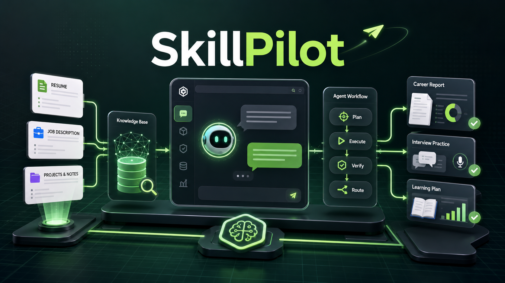
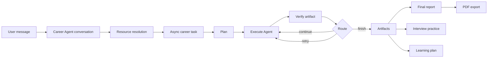
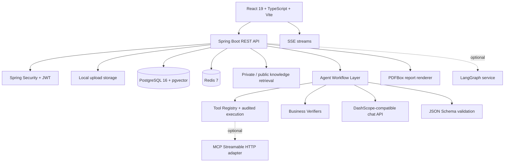

# SkillPilot / CareerAgent

AI-powered career preparation workspace built with Spring Boot, React, PostgreSQL + pgvector, Redis, and controlled Agent workflows.



## What it does

SkillPilot is a resume-driven career preparation platform. A user can upload a resume, job description, notes, or project documents, then let the system build a private knowledge base and run a structured Career Agent workflow.

The current product is closer to an Agent workspace than a simple chatbot:

- The frontend provides a conversational Career Agent entry point.
- The backend identifies intent and missing resources before starting long-running tasks.
- Resume, JD, project notes, and interview knowledge are parsed, chunked, embedded, and retrieved.
- Professional Agents produce concrete business artifacts: job match, resume analysis, interview questions, final report, and learning plan.
- Workflow execution follows Plan → Execute → Verify → Route, so each step can be checked, retried, skipped, or failed explicitly.
- Results can be streamed to the user, reviewed in the UI, and exported as PDF.

## Current capability map



## Architecture



## Highlights

- **Conversational Career Agent**: `/api/career-agent` supports intent recognition, resource cards, plan preview, streamed planning, and message history.
- **Private RAG knowledge base**: Apache Tika parses user files, the backend chunks content, and PostgreSQL + pgvector stores searchable knowledge.
- **Controlled tool calling**: Agents do not call arbitrary functions. Tools are registered, permission-scoped by Agent name, validated, logged, and protected by ownership checks.
- **Workflow with quality gates**: task execution is not “LLM says done”. Each business artifact is verified before the router decides whether to continue, retry, skip, replan, or fail.
- **Async + SSE user experience**: long-running career tasks are created after database commit, executed asynchronously, and streamed to the frontend through Server-Sent Events.
- **Interview and tutor modules**: users can practice interview answers, receive scoring/follow-up, review sessions, and continue with tutor memory.
- **PDF export**: final reports are rendered with PDFBox, safe local paths, atomic writes, pagination, and CJK font support.
- **CI-friendly design**: tests mock external model calls; GitHub Actions validates backend, frontend, dependency audit, and repository safety.

## Agent workflow in this project

The default Spring workflow runs these business steps:

1. **Job Match Agent** creates a job-match artifact.
2. **Resume Analysis Agent** creates resume strengths, gaps, and optimization suggestions.
3. **Interview Question Agent** creates targeted interview questions.
4. **Final Report Agent** aggregates previous artifacts into a final report.

The important design choice is that Agents are divided by business artifact, not by technical action. That makes ownership clearer: one Agent is responsible for one kind of output, while shared capabilities such as retrieval, file access, and report lookup are exposed through Tools.

The workflow runner uses four phases:

| Phase | Meaning in this project |
| --- | --- |
| Plan | Build an executable list of workflow steps and mark whether each step is required. |
| Execute | Run the current professional Agent and persist its artifact. |
| Verify | Check whether the artifact satisfies business quality signals. |
| Route | Decide whether to continue, retry, skip, replan, or fail. |

## Tool Registry

Registered tools include:

| Tool | Purpose |
| --- | --- |
| `getResume` | Read a user-owned resume resource. |
| `getJobDescription` | Read a user-owned job description resource. |
| `searchUserKnowledgeBase` | Retrieve private resume, JD, project, and note chunks. |
| `searchPublicInterviewKnowledge` | Retrieve curated public interview knowledge. |
| `getFinalReport` | Read final report context for learning-plan generation. |
| `CallMcpTool` | Optional MCP bridge, disabled by default. |

Tool execution is guarded by Agent allowlists, input validation, user ownership checks, audit logs, and prompt-injection/sensitive-field boundaries.

## Verifier depth

The current verifiers combine structural checks and business signals:

- Job match must produce an artifact, numeric score, and summary.
- Resume analysis must produce an artifact, summary, and actionable suggestions or next actions.
- Interview questions must meet minimum count, type diversity, difficulty diversity, expected-point coverage, and evidence coverage.
- Final report verification currently checks artifact existence/status and relies on upstream verified artifacts for most quality guarantees.

This means the system is honest about quality: JSON Schema ensures output shape, prompts define expected fields and boundaries, and Verifiers judge whether the artifact is useful enough to move forward. The final report verifier is intentionally lighter today and is a good future improvement point.

## Tech stack

| Layer | Technology |
| --- | --- |
| Backend | Java 21, Spring Boot 3.5, Spring Security, JPA, Flyway |
| Database | PostgreSQL 16 with pgvector |
| Cache / async support | Redis 7 |
| Frontend | React 19, TypeScript 6, Vite 8, Vitest |
| AI integration | DashScope-compatible chat API, structured prompts, JSON Schema |
| Retrieval | PostgreSQL vector search, keyword search, hybrid retrieval |
| Document parsing | Apache Tika |
| PDF export | Apache PDFBox + FontBox |
| Optional orchestration | LangGraph service, Spring fallback |
| Optional tools | MCP Streamable HTTP adapter, disabled by default |

Note: the current embedding implementation is local hashing-based and deterministic for development/testability. `.env` exposes embedding model settings, but a remote embedding provider implementation is not yet wired as the default runtime path.

## Main APIs

| Area | Endpoints |
| --- | --- |
| Auth | `/api/auth/register`, `/api/auth/login`, `/api/auth/me` |
| Conversational Agent | `/api/career-agent/intent`, `/api/career-agent/plan`, `/api/career-agent/plan/stream`, `/api/career-agent/messages` |
| Files | `/api/files/upload`, `/api/files/{fileId}/parse`, `/api/files/{fileId}/process` |
| Knowledge | `/api/knowledge/search`, `/api/documents/{documentId}/chunks`, `/api/documents/{documentId}/embeddings` |
| Resume / Job | `/api/resumes`, `/api/jobs` |
| Career Tasks | `/api/career-tasks`, `/api/career-tasks/{taskId}/progress`, `/api/career-tasks/{taskId}/events`, `/api/career-tasks/{taskId}/retry` |
| Reports | `/api/reports`, `/api/reports/{reportId}`, `/api/reports/{reportId}/pdf` |
| Learning Plans | `/api/learning-plans` |
| Interview | `/api/interview/questions`, `/api/interview/sessions`, `/api/interview/sessions/{sessionId}/answers/stream` |
| Tutor | `/api/tutor/sessions`, `/api/tutor/sessions/{sessionId}/messages/stream` |
| Public interview knowledge | `/api/interview-knowledge/search`, `/api/admin/interview-knowledge/sources` |

## Quick start

Requirements:

- Docker Desktop
- JDK 21 or newer
- Node.js 22 or newer

Recommended local startup:

```bash
./start-dev.sh
```

The script checks Java/Node/Docker, creates `.env` from `.env.example` when needed, starts PostgreSQL and Redis, installs frontend dependencies when needed, and launches backend + frontend together.

Open:

```text
http://localhost:5173
```

Manual startup:

```bash
cp .env.example .env
docker compose up -d postgres redis

set -a
source .env
set +a

JAVA_HOME=/opt/homebrew/opt/openjdk ./mvnw spring-boot:run
```

In another terminal:

```bash
cd frontend
npm ci
npm run dev
```

## AI configuration

Tests and CI do not require a real model key because external model calls are mocked.

For local AI analysis, configure:

```bash
DASHSCOPE_API_KEY=<your-key>
CHAT_MODEL=qwen-flash
```

Then restart the backend.

## Environment variables

| Variable | Purpose | Default |
| --- | --- | --- |
| `DATABASE_URL` | PostgreSQL JDBC URL | `jdbc:postgresql://localhost:5432/career_agent` |
| `POSTGRES_USER` | Database username | `career_agent` |
| `POSTGRES_PASSWORD` | Database password | `career_agent_dev_password` |
| `REDIS_HOST` / `REDIS_PORT` | Redis connection | `localhost:6379` |
| `JWT_SECRET` | JWT signing secret, at least 32 chars | required for real local run |
| `DASHSCOPE_API_KEY` | Real AI model key | empty |
| `CHAT_MODEL` | Chat model | `qwen-flash` |
| `EMBEDDING_MODEL` | Embedding model name config | `text-embedding-v4` |
| `EMBEDDING_DIMENSION` | Embedding vector dimension | `1024` |
| `UPLOAD_DIR` | Local upload storage | `./data/uploads` |
| `PDF_EXPORT_DIR` | Local PDF export storage | `./data/exports` |
| `PDF_FONT_PATH` | CJK font override for PDF rendering | auto-detect when possible |
| `WORKFLOW_ENGINE` | `spring` or `langgraph` | `spring` |
| `LANGGRAPH_BASE_URL` | Optional LangGraph service URL | `http://localhost:8090` |
| `MCP_ENABLED` | Optional MCP adapter switch | `false` |
| `MCP_ENDPOINT` | Optional MCP endpoint | empty |
| `MCP_ALLOWED_TOOLS` | Optional MCP tool allowlist | empty |
| `MCP_ALLOWED_AGENTS` | Optional MCP Agent allowlist | job/resume/interview agents |

## Quality checks

Backend:

```bash
JAVA_HOME=/opt/homebrew/opt/openjdk ./mvnw --batch-mode --no-transfer-progress verify
```

Frontend:

```bash
cd frontend
npm run check
npm audit --omit=dev --audit-level=high
```

Prompt regression gate:

```bash
JAVA_HOME=/opt/homebrew/opt/openjdk ./mvnw -Dtest=PromptRegressionSuiteTest test
```

## Optional LangGraph workflow engine

Spring is the default stable workflow engine. To try the optional LangGraph orchestrator:

```bash
docker compose --profile langgraph up -d langgraph
export WORKFLOW_ENGINE=langgraph
export LANGGRAPH_BASE_URL=http://localhost:8090
JAVA_HOME=/opt/homebrew/opt/openjdk ./mvnw spring-boot:run
```

If LangGraph is unavailable or returns an invalid plan, the Spring workflow fallback is used.

## Repository notes

Do not commit local runtime data or secrets:

- `.env`
- `data/`
- `target/`
- `frontend/dist/`
- uploaded resumes
- exported PDFs
- real API keys
- personal interview notes

The `docs/` directory is treated as local preparation material and is intentionally ignored for GitHub upload in this workspace.

## Roadmap

- Strengthen final-report verifier from artifact-existence checks to deeper content/evidence checks.
- Add a real remote embedding provider path beside the deterministic local embedding implementation.
- Improve task recovery UX for partially completed workflows.
- Add configurable Agent workflow templates.
- Add richer visual analytics for interview score trends.
- Add production object storage for uploads and PDF exports.
