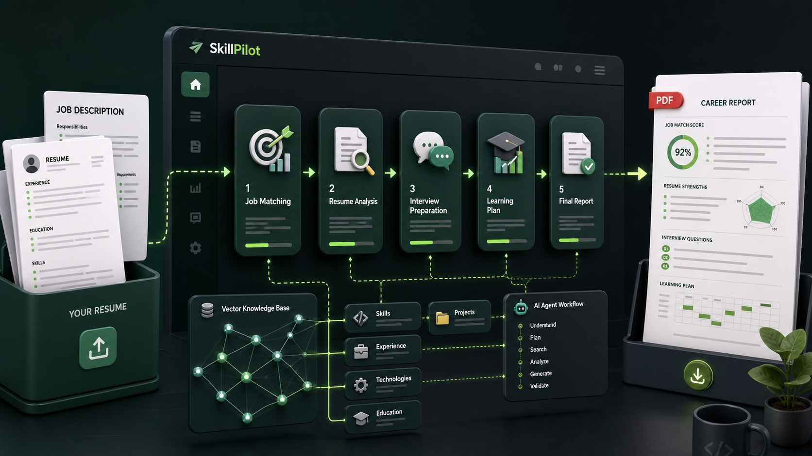
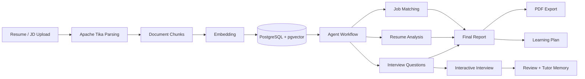
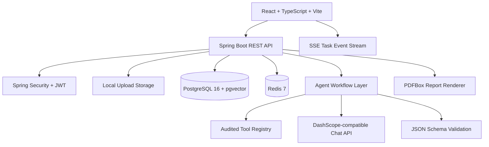

# SkillPilot / CareerAgent

AI-powered career preparation workspace built with Spring Boot, React, PostgreSQL + pgvector, Redis, and structured Agent workflows.



## Overview

SkillPilot is an AI career preparation platform for resume-driven job search workflows. It lets users upload resumes and job descriptions, parse documents into a private knowledge base, run structured AI agents, and generate a complete career preparation report.

The system is not a simple chatbot. It is built around a full workflow:

- Upload and parse resumes, job descriptions, notes, and project documents.
- Split documents into searchable chunks and create embeddings.
- Retrieve user-owned context from PostgreSQL + pgvector.
- Run career-analysis agents for job matching, resume analysis, interview questions, and final report aggregation.
- Stream task progress to the frontend with Server-Sent Events.
- Export final reports as PDF.
- Support interactive interview practice, answer scoring, review summaries, and tutor memory.

## Highlights

- **Resume and JD import**: Apache Tika detects and parses PDF, Word, Markdown, and text files.
- **Private RAG knowledge base**: document chunks are embedded and stored in PostgreSQL with pgvector.
- **Structured AI agents**: job matching, resume analysis, interview questions, learning plan, and report generation are separated into auditable stages.
- **Real-time task progress**: career tasks stream user-friendly progress through SSE.
- **Schema-safe model output**: important LLM responses are validated with JSON Schema and repaired or degraded when needed.
- **Interactive interview practice**: users answer questions, receive follow-up questions, scoring, and improvement suggestions.
- **Tutor memory**: long-running AI tutor sessions keep compact memory while avoiding unbounded prompt growth.
- **PDF report export**: final reports are rendered with PDFBox, including CJK font support, pagination, and safe local storage.
- **Security boundaries**: user-owned resources, upload validation, JWT auth, prompt-injection checks, tool-call auditing, and path traversal protection.

## Product Flow



## Architecture



## Tech Stack

| Layer | Technology |
| --- | --- |
| Backend | Java 21, Spring Boot 3.5, Spring Security, JPA, Flyway |
| Database | PostgreSQL 16, pgvector |
| Cache / stream support | Redis 7 |
| Frontend | React 19, TypeScript, Vite |
| AI | DashScope-compatible chat API, structured prompts, JSON Schema |
| Document parsing | Apache Tika, PDFBox through Tika |
| PDF export | Apache PDFBox + FontBox |
| Testing | JUnit, Spring Boot Test, Vitest, TypeScript build |

## Core Modules

### File Processing

Users upload files through `/api/files/upload` with a business type such as `RESUME`, `JD`, `NOTE`, or `PROJECT_DOC`.

The backend:

- detects physical file type with Apache Tika,
- rejects unsupported MIME types,
- stores files under a user-scoped directory,
- parses content with Tika,
- normalizes text,
- stores parsed content as a `Document`,
- chunks and embeds it for retrieval.

### RAG Knowledge Base

SkillPilot stores document chunks with source type, title, locator, content, token count, and embedding. Retrieval supports:

- vector search,
- keyword search,
- hybrid search.

Hybrid search is useful for resumes because technical keywords such as Spring Boot, Redis, PostgreSQL, and AI workflow should remain exact-match friendly while still allowing semantic retrieval.

### Agent Workflow

Career analysis runs as an asynchronous task instead of a blocking HTTP request.

Default workflow:

1. Read resume and job description.
2. Retrieve related context from the private knowledge base.
3. Run job matching.
4. Run resume analysis.
5. Generate interview questions.
6. Aggregate the final report.
7. Optionally generate a learning plan.

Each stage writes execution logs and tool-call logs. The frontend maps technical logs into user-friendly progress steps.

### Report and PDF Export

Final reports aggregate:

- job match score and reasoning,
- strengths and gaps,
- resume optimization suggestions,
- targeted interview questions,
- citations,
- learning plan when available.

PDF export uses Apache PDFBox directly. The renderer controls CJK fonts, wrapping, pagination, page footers, local export paths, and safe atomic writes.

### Interview and Tutor

The interview module supports:

- session creation by resume and job,
- question-by-question answers,
- streamed response handling,
- scoring and follow-up decisions,
- session review,
- memory summaries.

The tutor module can bind a session to resume, job, interview question, evaluation, or learning plan. It retrieves relevant private and public context and keeps compact long-term memory for continued coaching.

## Main APIs

| Area | Endpoints |
| --- | --- |
| Auth | `/api/auth/register`, `/api/auth/login`, `/api/auth/me` |
| Files | `/api/files`, `/api/files/{id}/process` |
| Knowledge | `/api/documents/{id}/chunks`, `/api/documents/{id}/embeddings` |
| Resume / Job | `/api/resumes`, `/api/jobs` |
| Career Tasks | `/api/career-tasks`, `/api/career-tasks/{id}/progress`, `/api/career-tasks/{id}/events` |
| Reports | `/api/reports`, `/api/reports/{id}`, `/api/reports/{id}/pdf` |
| Learning Plans | `/api/learning-plans` |
| Interview | `/api/interview/sessions`, `/api/interview/sessions/{id}/answers/stream` |
| Tutor | `/api/tutor/sessions`, `/api/tutor/sessions/{id}/messages/stream` |

## Quick Start

Requirements:

- Docker Desktop
- JDK 21 or newer
- Node.js 22 or newer

Create local environment:

```bash
cp .env.example .env
```

Set a real local JWT secret before starting the backend:

```bash
openssl rand -hex 32
```

Put the generated value into `.env`:

```bash
JWT_SECRET=<your-64-char-secret>
```

Start PostgreSQL and Redis:

```bash
docker compose up -d postgres redis
```

Start backend:

```bash
set -a
source .env
set +a

JAVA_HOME=/opt/homebrew/opt/openjdk ./mvnw spring-boot:run
```

Start frontend in another terminal:

```bash
cd frontend
npm ci
npm run dev
```

Open:

```text
http://localhost:5173
```

Health check:

```bash
curl http://localhost:8080/actuator/health
docker compose ps
```

## AI Configuration

The app can run tests without a real LLM key because integration tests mock external model calls.

For real AI analysis, configure DashScope-compatible settings in `.env`:

```bash
DASHSCOPE_API_KEY=<your-key>
CHAT_MODEL=qwen-flash
```

Then restart the backend.

## Environment Variables

| Variable | Purpose | Default |
| --- | --- | --- |
| `DATABASE_URL` | PostgreSQL JDBC URL | `jdbc:postgresql://localhost:5432/career_agent` |
| `POSTGRES_USER` | Database username | `career_agent` |
| `POSTGRES_PASSWORD` | Database password | `career_agent_dev_password` |
| `REDIS_HOST` | Redis host | `localhost` |
| `REDIS_PORT` | Redis port | `6379` |
| `JWT_SECRET` | JWT signing secret, at least 32 chars | Required for local run |
| `DASHSCOPE_API_KEY` | Real AI model key | Empty |
| `CHAT_MODEL` | Chat model | `qwen-flash` |
| `UPLOAD_DIR` | Local upload storage | `./data/uploads` |
| `PDF_EXPORT_DIR` | Local PDF export storage | `./data/exports` |
| `WORKFLOW_ENGINE` | Workflow engine: `spring` or `langgraph` | `spring` |
| `MCP_ENABLED` | Optional MCP Streamable HTTP adapter | `false` |

## Quality Checks

Backend:

```bash
JAVA_HOME=/opt/homebrew/opt/openjdk ./mvnw test
```

Frontend:

```bash
cd frontend
npm run build
```

Prompt regression gate:

```bash
JAVA_HOME=/opt/homebrew/opt/openjdk ./mvnw -Dtest=PromptRegressionSuiteTest test
```

## Optional LangGraph Workflow Engine

Spring is the default stable workflow engine. To run the optional LangGraph orchestrator:

```bash
docker compose --profile langgraph up -d langgraph
export WORKFLOW_ENGINE=langgraph
export LANGGRAPH_BASE_URL=http://localhost:8090
JAVA_HOME=/opt/homebrew/opt/openjdk ./mvnw spring-boot:run
```

If LangGraph is unavailable or returns an invalid plan, Spring fallback is used by default.

## Repository Notes

Local runtime data is intentionally ignored:

- `.env`
- `data/`
- `target/`
- `frontend/dist/`
- `INTERVIEW_GUIDE.md`

Do not commit uploaded resumes, exported PDFs, real API keys, or local interview notes.

## Documentation

- [Testing strategy](docs/testing.md)
- [Security review](docs/security-review.md)
- [Troubleshooting runbook](docs/runbook.md)
- [Release checklist](docs/release-checklist.md)

## Roadmap

- Richer task recovery and partial report UX.
- Configurable Agent workflow templates.
- More visual analytics for interview score trends.
- Optional speech input and spoken mock interviews.
- Production-ready object storage for uploaded files and PDF exports.
